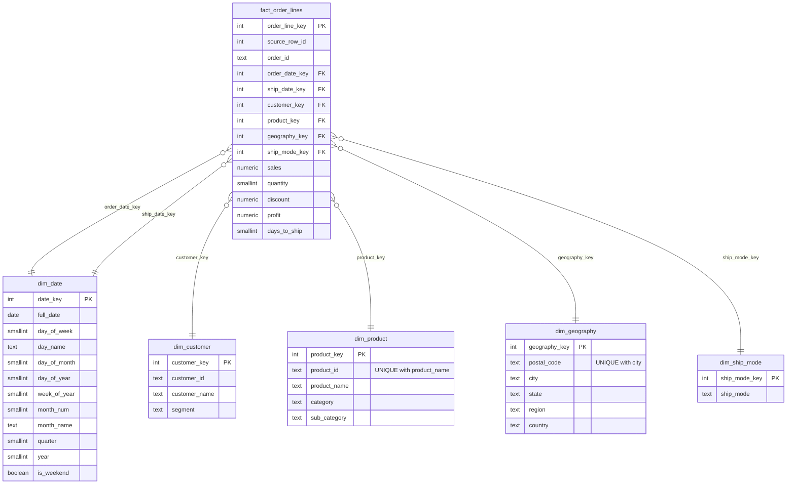

# Superstore Star Schema — Entity Relationship Diagram

```mermaid
erDiagram
    dim_date {
        int date_key PK
        date full_date
        smallint day_of_week
        text day_name
        smallint day_of_month
        smallint day_of_year
        smallint week_of_year
        smallint month_num
        text month_name
        smallint quarter
        smallint year
        boolean is_weekend
    }

    dim_customer {
        int customer_key PK
        text customer_id
        text customer_name
        text segment
    }

    dim_product {
        int product_key PK
        text product_id "UNIQUE with product_name"
        text product_name
        text category
        text sub_category
    }

    dim_geography {
        int geography_key PK
        text postal_code "UNIQUE with city"
        text city
        text state
        text region
        text country
    }

    dim_ship_mode {
        int ship_mode_key PK
        text ship_mode
    }

    fact_order_lines {
        int order_line_key PK
        int source_row_id
        text order_id
        int order_date_key FK
        int ship_date_key FK
        int customer_key FK
        int product_key FK
        int geography_key FK
        int ship_mode_key FK
        numeric sales
        smallint quantity
        numeric discount
        numeric profit
        smallint days_to_ship
    }

    fact_order_lines }o--|| dim_date : "order_date_key"
    fact_order_lines }o--|| dim_date : "ship_date_key"
    fact_order_lines }o--|| dim_customer : "customer_key"
    fact_order_lines }o--|| dim_product : "product_key"
    fact_order_lines }o--|| dim_geography : "geography_key"
    fact_order_lines }o--|| dim_ship_mode : "ship_mode_key"
```
